Simple and practical website for CrossFit fanatics!

CrossFit Gear is a full stack e-commerce web application with a small, unique selections of products and gifts that someone interested in the world of CrossFit will enjoy. Or a friend who wants to surprise a love one with a funky gift.

This website is for educational purposes only. So on this website please use only the details below in the card sections 
Card number: 4242 4242 4242 4242
Use any expiration date (month/year) in the future, any 3 digit CVC code and 5 digit post code.

This website is my five and final ‘Milestone Project’ as part of the Full Stack Development journey of Code Institute. The focus is on using the Django framework,  an authorisation and authentication system and using, learning about  Stripe for payments and AWS cloud base storage services. 

A live website can be view on https://crossfit-gear.herokuapp.com/

# Business Model
I’ve created this website, as my self I’m a keen crossifiter and noticed there are not a lot of website dedicated to this discipline. Also few of my friends wanted to get my some CrossFit related gifts for my bday or xmas but,  didn’t know where to go, where to start
The website has a simple laylout and only few products as this is quite a niche sport and want to test the waters on what products are popular before I change my stock. 

This is a Business to Customer (B2C) application, selling CrossFit products/accessories with a single payment model using stripe 

Marketing tools: To attract more traffic to my website I’ve used few marketing tools.  SEO have been used by adding keywords to the code so and organic Social media, which for a small website like this works great, as I’m starting to build my brand identity and connect and interact with potential customers directly. The CrossFit world already using social media and share it content so my audience would be easy to reach. My Business Facebook has few links to my CrossFit gyms in London and few posts regarding some of the products, I can receiving feedback on the products, also it can be easily share with other within social platforms.
I have also created a subscribe function so the costumers can opt in to receive an email information from me, regarding new products and any sales. So I can keep promoting my little business. 

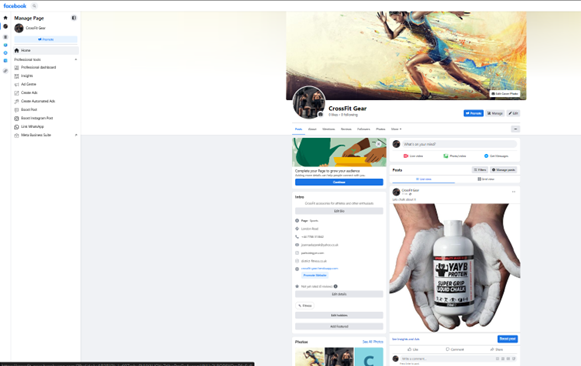

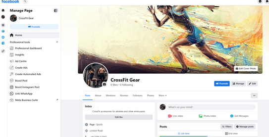

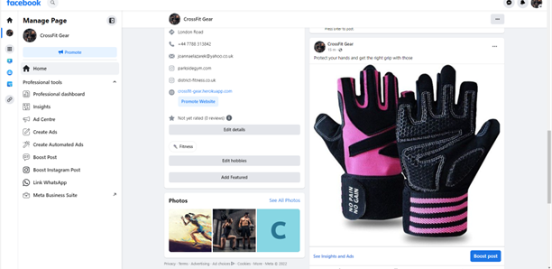

Features: The website is a to provide a product to my customers so I follow the course example and created a simple payment method and adding an authentication system for extra security. The customer can search and filter products, which have images and short description and the product also have rating system.  The shopping basket is provides overview of the order and allows the customer to add, delete and update the content. 

Database: The purpose of this website is to provide a product to my customer and deliver it to them, so the data I need to store is:
•	Customer – name, username, first name, and password 
•	Products – image, name, price, etc.
•	Order – what products and the quantity, the user details (name, address, etc), total amount and delivery address 

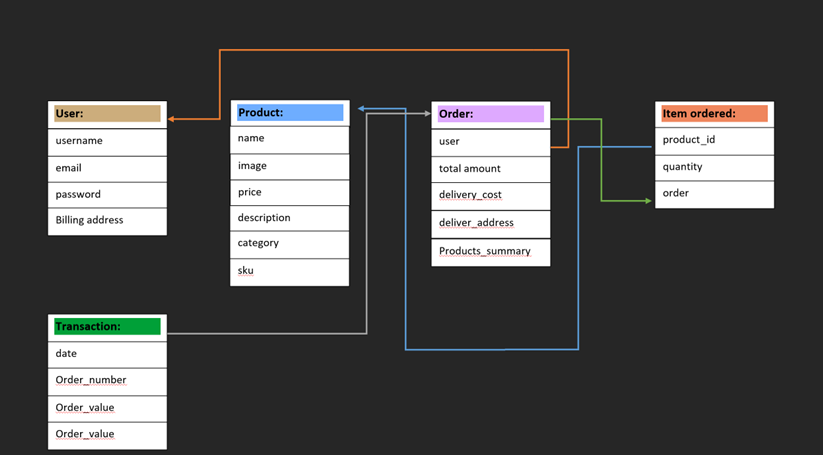

## See user stories 

I have plan this project which I've based on the course material as a ecommerce website and I've used agile aproched as it is felxible and easier to make changes.
I've created the following wireframe, for this project, howerver the final project looks bit different. 

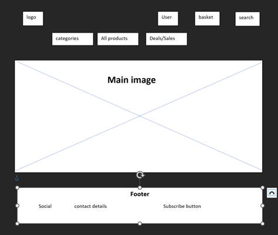

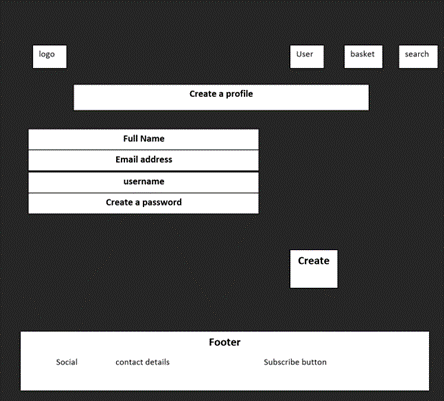

I've created user stories and input them as issue to Github and personalise lables with MoSCoW prioritization technique. I added few milestone of the project so I could reach the dealine without missing on any user stories.  With my still limited experience in codding, I've used storie points to estimate how long will it takes to complete them. Story point with 2 next to it will take twice as long as a story with only 1 point next to it and I've made lables for them too. Since I was the only one working on this project I've only used the tools that I need it.

I've used Board Boards as information radiator with 3 columns, TO DO, IN PROGRESS and DONE and moved the stories accordingly. 

Please see screenshots: 

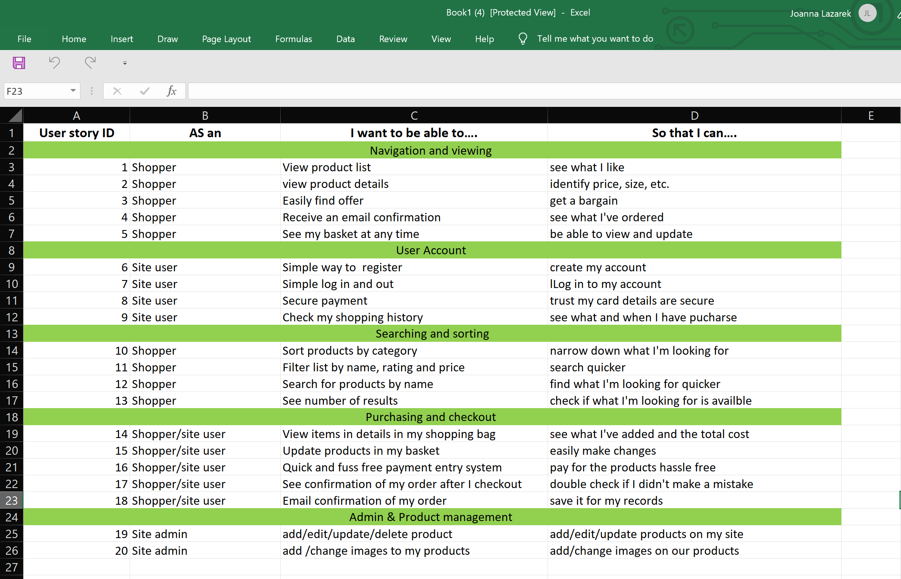

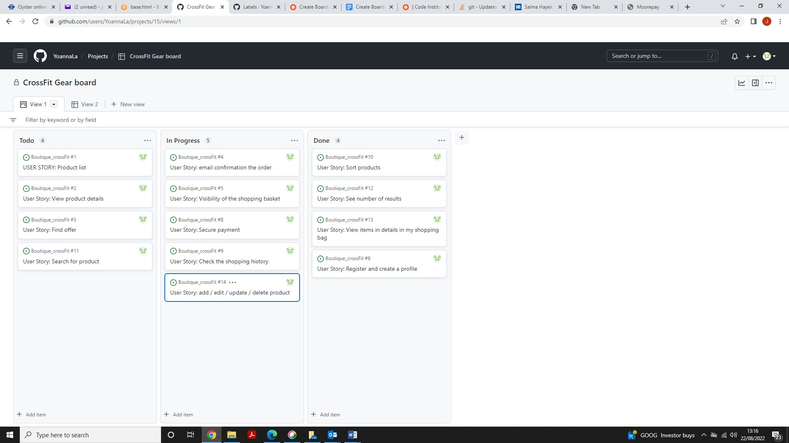

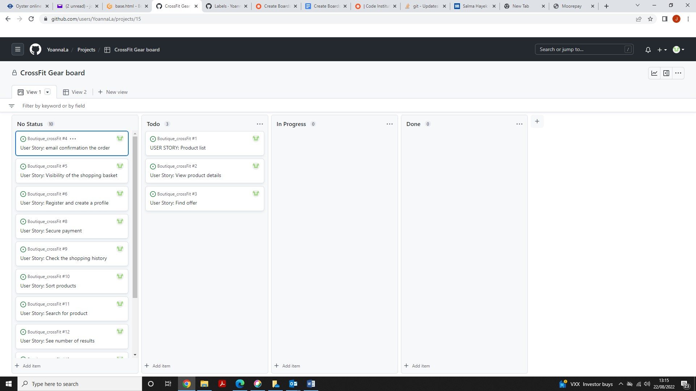

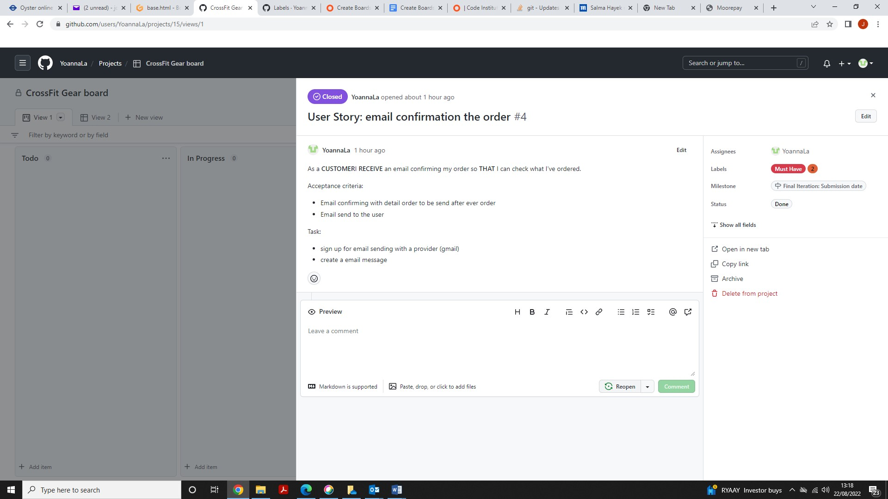

### Requirements
1. A home page with nav bar
2. A design which is responsive on different screen sizes
3. A product page
4. A option to register and login to a personal account
5. A page with all the products
6. A all products page
7. Banner reading new deals
8. Adding products to a shopping baskets, choosing size and units
9. An option to search
10. An option to filter products
11. An indication of search and numbers of results
12. A page to checkout with the products and costs
13. Possibility to adjust the shopping basket
14. Secure checkout with the payment details using Stripe
15. Email confirming the purchase details
16. Secure admin site for the website owner to Add, Edit, Delete a product

### Additional requirements 
1. Recover your password

# Structure of the website
The overall look is kept the same on each page as much as possible, to enhance single-use-learning:
* The header and footer are the same on each page.
* Buttons are styled in the same way.
* The layout is consistent

The navigation is simple and consistent:
* home page show nav bar
* The logo at the top of the page is also the link to the home page.
* Buttons can be used to navigate products sorting, products categories and special offers
* Search button, profile, and shopping basket buttons 
* "Have a look" button which takes user to all products page
* banner with a wrapping deal if the purchase spends more than £25

The information provided should be easily visible:
* The user see on which page they are, e.g. by using headers.
* The user gets a visual feedback during certain actions (e.g. focussing on, clicking on, hovering over buttons and links).
* Messages(toasts) are used to confirm or inform about current actions.

## Wireframes (home page, shop page, basket, login, signin profile)

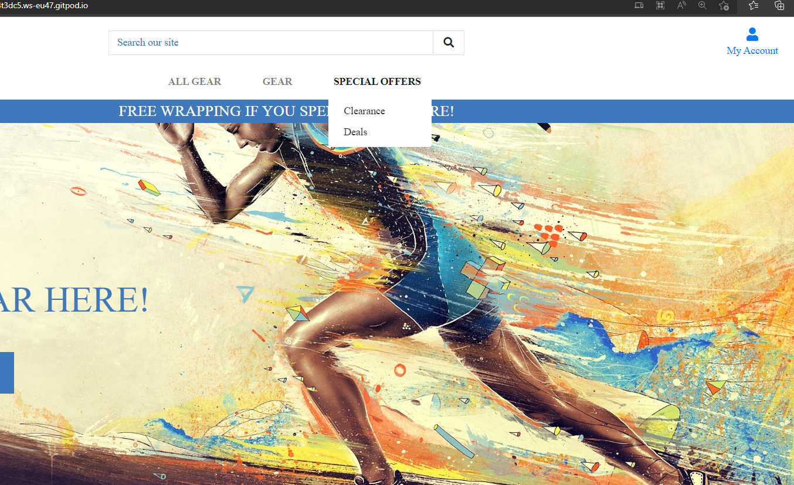

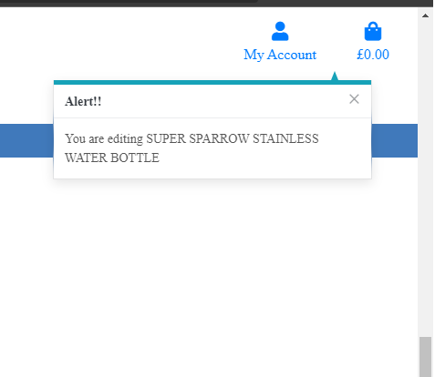

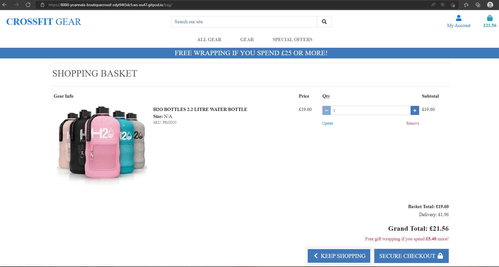

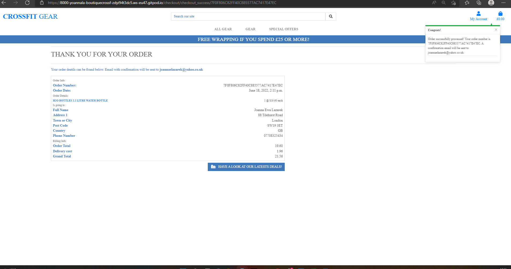

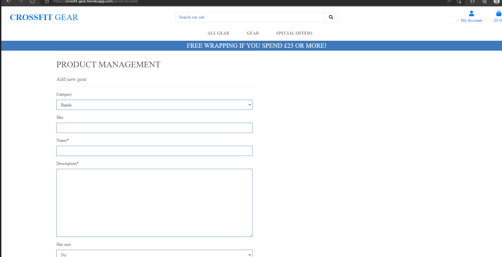

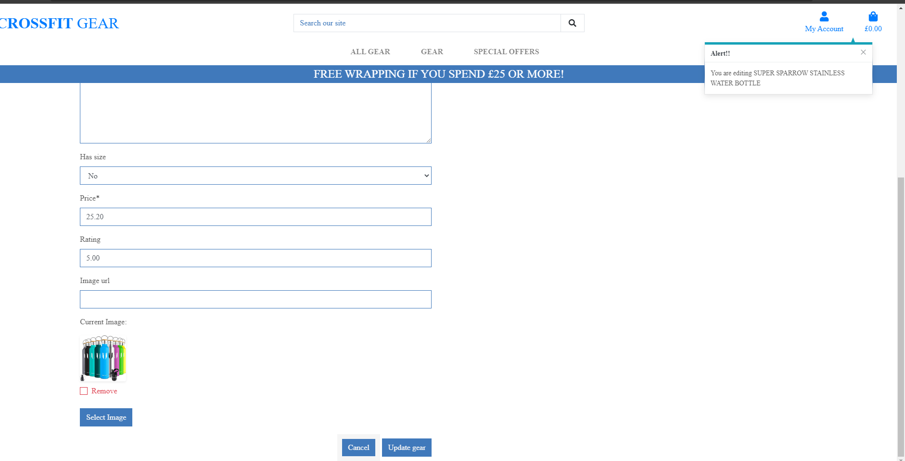

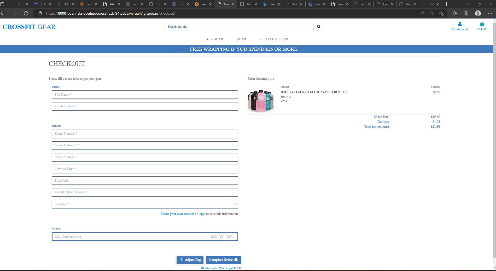

## Colors and  font
 * Roboto for font
 * Color - #555 and  rgb(64, 121, 187)

# Features
## Features 
* Responsive on all devices
* A nav bar allows user to navigate the website easier, on small devices in collapse into hamburger menu to make it readable
* Function to register for an account, by filling a form
* Function to log in an log out of the account, by filling a form 
* A search bar, to easily find a product 
* A search button to search by price, rating, and category
* Categories under the gear tap, to make it quicker to find a product
* A Special offers button to see what deal the site can offer
* Payment function using Stripe
* Toast messages to inform user after completing a function 
* A confirmation modal after purchasing 

## Forms
* A resister form to sign up for a account
* A sign in form
* A checkout form for the purchasing, with the payment details
* A form that allows to add, review and delete products - admin access only

## CRUD (Create, Read, Update, Delete) function

* Create 
    1. Admin to create a new product 

* Read 
    1. Users can search and view products in detail

* Delete
    1. Admin can delete any products from the site

## Features still to be implement
1. Delete a user/profile by the user 

# Technologies used
## Languages
* HTML5 for markup.
* CSS for styling.
* Javascript for interactivity.
* Python3 for backend programming.

## Frameworks & libraries used
* Bootstrap - code snippets to assist with the responsiveness of the site
* jQuery, a javascript library 
* Google fonts 
* Font Awesome for the icons used
* Django is a high-level Python web framework for 

## Tools & Programmes used
* microsoft word to making the wireframes.
* Chrome Developer Tools to sort out any bugs, size issue
* GitHub for storing the files and version control of the website.
* PostgreSQL .
* Amazon AWS used to store static files after deployment.
* Heroku a cloud platform for deploying my site
* W3C Markup Validation
* W3C CSS Validation Service for CSS
* JSHint to check the Javascript code.
* PEP8 checker to clean up the code

# Deployment
The site was building using Git and pushed to GitHub:
    git add .
    git commit -m "commit message"
    git push

Heroku was used for deployment

## Heroku :

1. Create a heroku app
* Log in to my Heroku account
* Create a new app and follow instructions 

* Using "resource" tab and add a postgres to the app
* Submit the form

2. Postgress Database:
* Install dj_database and psycopg2.
    pip3 install dj_database_url
    pip3 install psycopg2-binary
* Create requirement.txt file and freeze and add the databases to the file 
* Add the databases in sittings files 
* Scroll down to DATABASES, comment out the default configuration and add the database url from Heroku
DATABASES = {
        'default': dj_database_url.parse('DATABASE_URL')
}
You can the database url from Heroku's Config Vars in the Settings tab.

* Run migration - python3 manage.py runmigrations
* Using local database loaddata db.json and import the categories 

3. Create a superuser form my admin panel
* Type: python3 manage.py createsuperuser
* Add a username and password

4. Local and remote database:
if 'DATABASE_URL' in os.environ:
    DATABASES = {
        'default': dj_database_url.parse(os.environ.get('DATABASE_URL'))
    }
else:
    DATABASES = {
        'default': {
            'ENGINE': 'django.db.backends.sqlite3',
            'NAME': BASE_DIR / 'db.sqlite3',
        }
    }

5. Installing gunicon - pip3 install gunicorn
6. Create Procfile and adding web: gunicorn appname.wsgi:application in the folder
7. Connect to heroku in the terminal - I had to use the Heroku login -i with my credetials 
    * Temporarily disable the collection of static files - heroku config:set DISABLE_COLLECTSTATIC=1 --app <Heroku appname>
    * add the host mame in settings.py - ALLOWED_HOSTS = ['<heroku appname>.herokuapp.com', 'localhost']
    * commit to GitHub
    * commit to Heroku - heroku git:remote -a <Heroku appname>
    * push to Heroku - git push heroku

8. Deploy from GitHub - after creating a new app - go to deploy page

* Automatic deploys - Enable Automatic Deploys

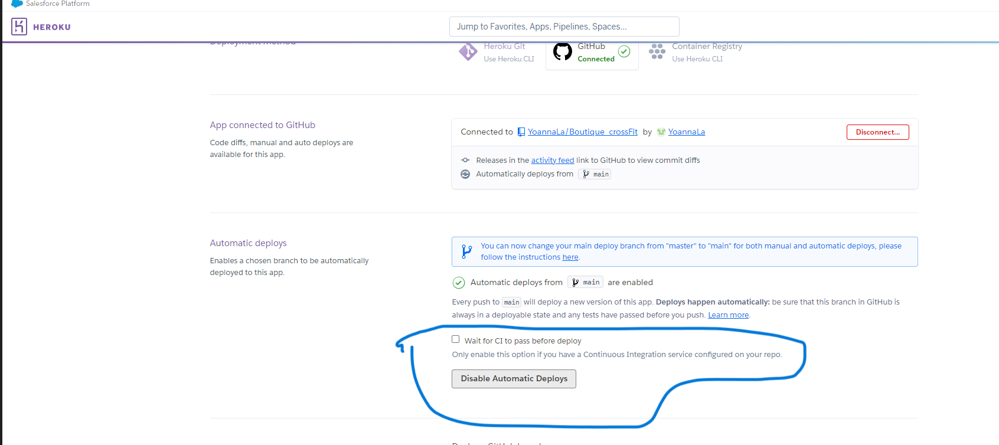

* I also manually deployed the app 

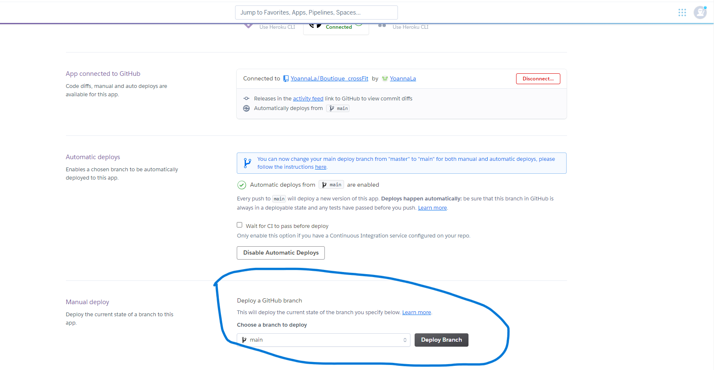

9. Set up Amazon AWS
    * Create a new account
    * Search for S3 in the search option 
    * Create a new bucket - crossfit-gear 

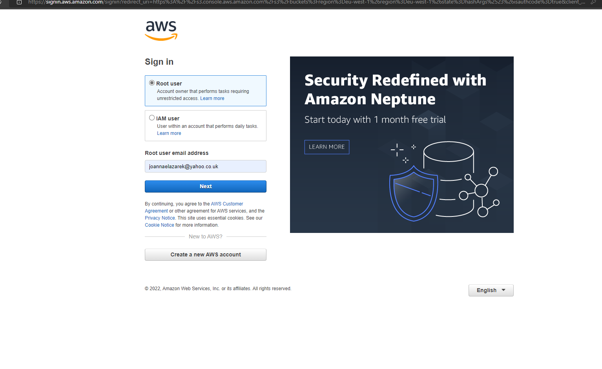

    * Select the right region
    * uncheck - block all public access
    * create bucket 
    * set basic settings - click on the backet name - properties - scroll down static website hosting and edit settings
        and enable static website hosting - type index.html index document  and error.html in Error document and save the changes
    * Find Permissions tab - edit function CORPS and past this configuration and save changes
{
	"Version": "2012-10-17",
	"Id": "Policy1655380121260",
	"Statement": [
		{
			"Sid": "Stmt1655380118565",
			"Effect": "Allow",
			"Principal": "*",
			"Action": "s3:GetObject",
			"Resource": "arn:aws:s3:::crossfit-gear/*"
		}
	]
}
    * Bucket policy - permission tab - scroll down to Bucket Policy and edit 

    * In the new window - select S3 Bucket policy in Step 1 - Select Policy Type
    *  Add Step 2 - Add Statements(s) as per image 
    * ARN is found on the policy generator as image

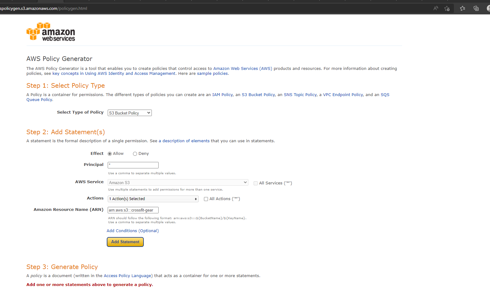

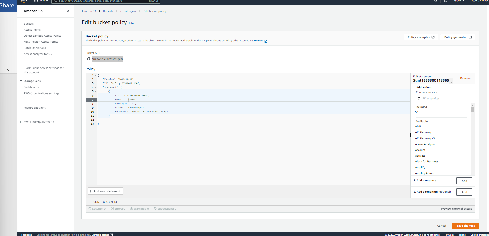

    * Click 'Generate policy'.
    * Copy the policy and paste it in the Bucket Policy of the first tab.
    * Add '/*' to the end of the resource key.
    * Click 'Save changes'.
    * Scroll down to Access control list (ACL) and click 'Edit'.
    * Select 'List' for Everyone (public access) and select 'I understand...' at the bottom. - save changes

    * Create AWS groups, policies and users
    * Click Iam (via search bar or Services).
    * Create a group
    * Click on 'Users groups' on the left.
    * Click 'Create group' and enter a group name.
    * Scroll down and click 'Create group'.
    * Create the policy used to access the bucket
    * Click on 'Policies' on the left.
    * Click 'Create policy'.
    * Click the JSON tab and then on 'Import managed policy'.
    * Search for 'S3' in the pop up window and select 'AmazonS3FullAccess' and click 'Import'.
    * Add media files to S3
        * Open the folder and click 'Upload'.
        * Click 'Add files' and select all your product images.
        * Under 'Permissions' select 'Grant public-read access'.
        * Select 'I understand...' and click 'Upload'.

10. Payment with stripe 

  * create an account with stripe - https://stripe.com/
  * Click developers and then API Keyy, use the public and secret key and add them to Config Vars in Heroku.
    * STRIPE_PUBLIC_KEY = <your Stripe public key>
    * STRIPE_SECRET_KEY = <your Stripe secret key>
    * Create a webhook endpoint
    * In Stripe - Developers click 'webhooks'.
    * Click 'Add endpoint'.
    * Enter your heroku url and add /checkout/wh/ to it.
    * https://<projectname>.herokuapp.com/checkout/wh/

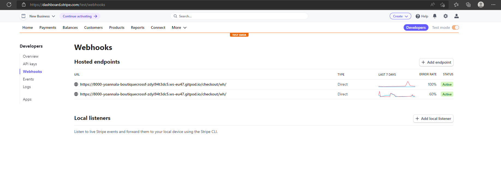

    * Select 'receive all events' and click 'Add endpoint.
    * Scroll down to 'Signing secret' and click 'Reveal signing secret'.
    * Copy the signing secret and add to the Config Vars in Heroku.

11. Use s3 to store our static files.
    Add the ode to custom_storages.py
    from django.conf import settings
    from storages.backends.s3boto3 import S3Boto3Storage

# GitHub Repository
*   A fork is a copy of a repository. Forking a repository allows you to freely experiment with changes without affecting the original project. 

    * Login to GitHub and follow this link to the GitHub Repository.
    * At the top right of the page, click on the fork button.
    * You now have a copy of the repository in your GitHub account.
# Cloning the GitHub repository
    * Log in to GitHub find the repository 
    * Click on the ‘Code’ button

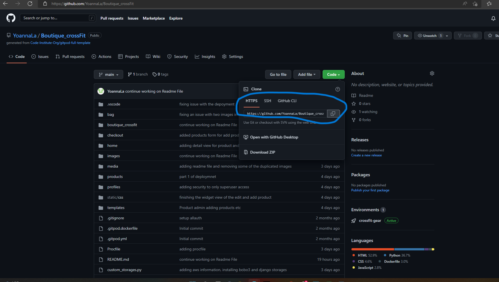
    * Click the button 'Clone Repository', add the url you copied above and hit enter.
    * A clone will be created locally.
   

# Credits

## Code
1. The project is heavily based on the Code Institute walkthrough project 5 - 'Boutique Ado". 
The Code has been copied and adopted form the videos provided

code for the footer was take and adjusted from 
https://www.w3schools.com/howto/howto_css_fixed_footer.asp

## Content
1. Product description have been taken from - https://www.amazon.co.uk/

## Media 
1. All the product images and descriptions - https://www.amazon.co.uk/
2. Main image - https://www.bing.com/images/

## Acknowledgements
* A big thank you to some of the very dedicated tutors who clearly love their job
* A thank you for all the advise I was able to search in Slack
